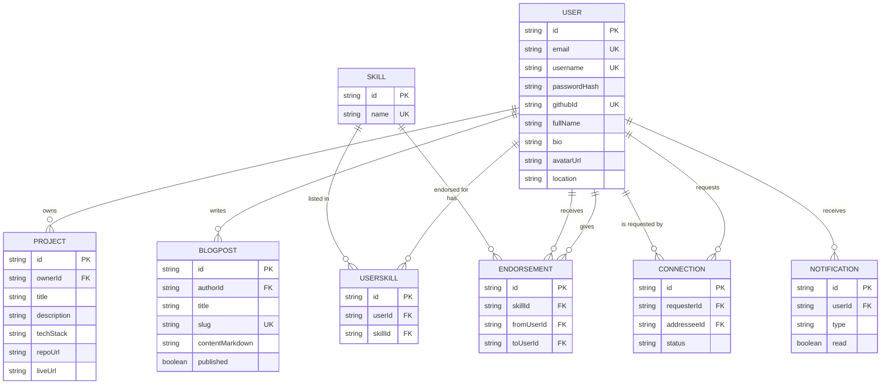

# DevConnect — Database Schema

Entity-relationship overview (see `server/prisma/schema.prisma` for the full source of truth).

**Key design decisions:**
- `Endorsement` has a unique constraint on `(skillId, fromUserId, toUserId)` — one endorsement per skill per pair.
- `Connection` has a unique constraint on `(requesterId, addresseeId)` and a `status` enum (`PENDING`/`ACCEPTED`/`REJECTED`), so duplicate requests are rejected at the database layer, not just in application code.
- `Project.techStack` is a native Postgres array column (no join table needed for a simple tag list).
- Cascading deletes (`onDelete: Cascade`) mean deleting a user cleans up their projects, posts, endorsements, connections, and notifications automatically.
