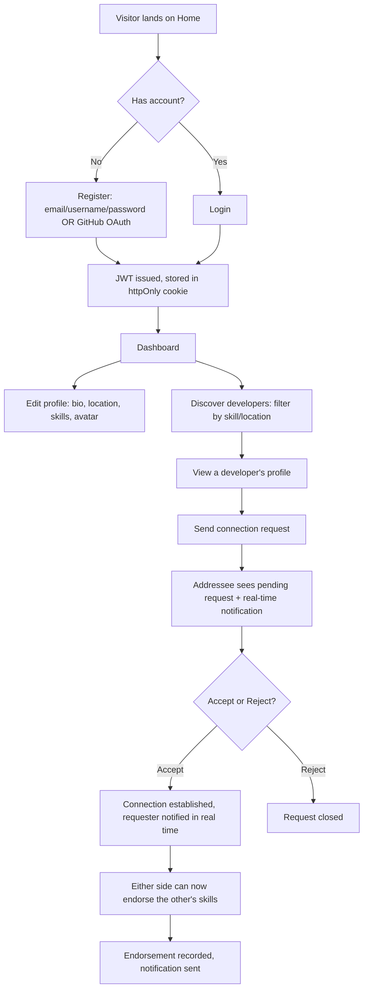

# DevConnect — Core User Flows

## 1. Registration -> Profile -> Connect -> Endorse

## 2. Project showcase flow
`Profile (own) -> Add project form -> title/description/tech stack/image -> Cloudinary upload -> Project card appears on public profile`

## 3. Blog flow
`Blog list -> Write a post -> Markdown editor -> Save draft or Publish -> Slug generated -> Post viewable at /blog/:slug with rendered Markdown`

## 4. Real-time notification flow
`Action (connection request / accept / endorsement) -> Server writes Notification row -> Server emits Socket.io event to the target user's active sockets -> Client updates in-app notification state`
